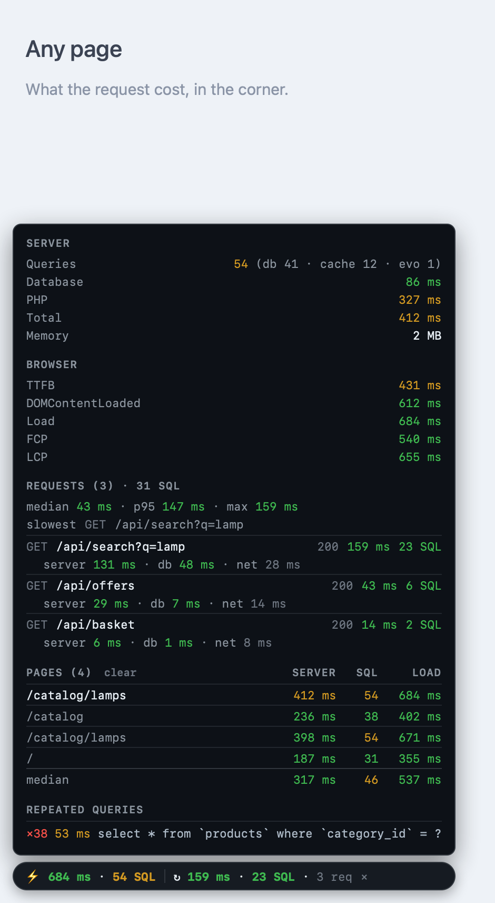

# Sonar

[](https://github.com/hkyss/sonar/actions/workflows/ci.yml)
[](https://packagist.org/packages/hkyss/sonar)
[](composer.json)
[](LICENSE)

Request performance overlay for PHP. A pill in the corner of the page reports
what the request cost: database queries, server timings, browser metrics, and
every XHR and fetch the page makes with its own server-side query count.



- Framework-agnostic core. Integrations for Laravel, Evolution CMS 3, PSR-15 and plain PDO.
- No runtime dependencies, no build step, no published assets: the CSS and the JS are inlined before `</body>`.
- Off by default. While off, nothing is collected and nothing is rendered.
- Statements are stored as fingerprints, so bind values never reach the page.

## Install

```bash
composer require --dev hkyss/sonar:^1.0
```

The root namespace is `hkyss\Sonar\`, lowercase vendor. PHP resolves class names
case-insensitively but Composer matches PSR-4 prefixes case-sensitively, so
`use Hkyss\Sonar\Sonar;` gets you a class that PHP considers the same and the
autoloader cannot find. Copy the imports as written.

## Enable

`SONAR` takes `false` (off), `true` (visible to everyone) or `gated` (collected
always, shown only to whoever the gate allows).

```dotenv
SONAR=true
SONAR_MAX_QUERIES=200
```

Two settings refuse to do the dangerous thing:

- `true` is ignored when the environment is production, because it shows the
  overlay to anonymous visitors. To look at a live site, use `gated`.
- `gated` without a gate is off. There is no default gate to fall back on.

## Laravel

The service provider is auto-discovered. It listens for `QueryExecuted`,
attaches `SonarMiddleware` to every matched route, injects the overlay into HTML
responses and adds `X-Sonar-*` headers to the rest.

```bash
php artisan vendor:publish --tag=sonar-config
```

```php
// config/sonar.php
return [
    'enabled' => env('SONAR', false),
    'max_queries' => 200,
    'gate' => fn ($app) => $app['auth']->user()?->isAdmin() ?? false,
];
```

Under Octane the provider hooks `RequestReceived` to open each request. Nothing
to configure.

## Evolution CMS 3

Register the EVO provider instead of the Laravel one. It injects through
`OnWebPagePrerender`, which also covers pages served from the EVO page cache,
and gates on a manager login.

That event carries a whole document, so a template spelling no `</body>` — the
one a fresh installation serves until it is given templates of its own — still
gets the overlay, appended to the end. Documents that are not HTML are left
alone by their own content type, which is where a sitemap or a feed says so.

```php
// core/custom/config/app/providers/SonarServiceProvider.php
<?php return \hkyss\Sonar\Integration\Evolution\SonarEvolutionServiceProvider::class;
```

Set `SONAR=gated` in `core/custom/.env` or in the web server environment
(`env[SONAR]` in the php-fpm pool, `SetEnv SONAR gated` for mod_php).

Queries arrive from two places. EVO 3.1 runs its legacy `evo()->db` API on an
Illuminate connection but calls `logQuery()` with **seconds** where Illuminate
reports **milliseconds**. The integration tells them apart through
`Connection::beforeExecuting`, which only fires for Illuminate-driven queries,
and normalises the legacy timings. `evo()->executedQueries` is not used — EVO
never increments it.

Registration is idempotent: a package chain where several providers extend one
another and each registers Sonar wires the listeners once.

## PSR-15

```php
use hkyss\Sonar\Config;
use hkyss\Sonar\Integration\Psr15\SonarMiddleware;
use hkyss\Sonar\Sonar;

Sonar::boot(Config::fromEnv());

$pipeline->pipe(new SonarMiddleware($streamFactory));
```

The middleware opens a new request on the way in, which is what keeps the
figures per-request under RoadRunner, Swoole and friends. Mount it first. If it
has to sit behind other middleware, pass `new SonarMiddleware($factory, false)`
and call `Sonar::start()` yourself at the real request boundary.

## Plain PHP

```php
use hkyss\Sonar\Config;
use hkyss\Sonar\Integration\Pdo\TracingPdo;
use hkyss\Sonar\Sonar;

Sonar::boot(Config::fromValue(true));

$pdo = new TracingPdo('mysql:host=localhost;dbname=app', $user, $password);

echo Sonar::inject($html);
```

## API

| Call | Purpose |
| --- | --- |
| `Sonar::boot(?Config)` | Start collecting; returns `null` when disabled |
| `Sonar::start(?Config)` | Open a new request: drop what was collected, restart the clock |
| `Sonar::record($sql, $ms, $source)` | Log one statement |
| `Sonar::add($source, $count, $ms)` | Log totals for a source that cannot report statements |
| `Sonar::addUsing($source, $resolver)` | Same, resolved at snapshot time |
| `Sonar::mark($name, $ms)` / `Sonar::timer($name)` | Named timing, e.g. SSR or a template render |
| `Sonar::meta($key, $value)` | Extra row in the panel; a closure is resolved at snapshot time |
| `Sonar::snapshot()` | Everything collected, as an array |
| `Sonar::headers()` | `X-Sonar-*` headers for the current request |
| `Sonar::inject($html)` | Overlay inserted before `</body>` |

Connecting a system Sonar has never heard of is these calls and nothing else —
see [docs/integrations.md](docs/integrations.md).

## Reading the overlay

The pill carries two readings. The first is the page — its load time and its
query count — and it stays for as long as the page does. The second appears once
the page makes a request: the last one the application answered, its round trip
and its query count, and how many requests there have been. On a page that
navigates by `fetch`, that makes it the cost of the screen just loaded rather
than a total that only ever climbs, and the page's own figures never leave the
corner.

| Row | Meaning |
| --- | --- |
| `Queries` | Total across all sources, broken down per source |
| `Database` / `PHP` / `Total` | Wall clock split between SQL and everything else |
| `Requests` | XHR and fetch calls: the median, the 95th percentile and the slowest, then each call with its round trip and query count, split into server, database and network time |
| `Repeated queries` | The same statement run more than once |

A request's split comes from the headers on its response: `server` is
`X-Sonar-Time`, `db` is `X-Sonar-Query-Time`, and `net` is whatever part of the
round trip the server does not account for. A call to a third party carries no
headers and gets no split.

Identical statements collapse into one row with a counter, so an N+1 reads as
`×40` rather than forty lines. What is shown is the fingerprint — literals
replaced by `?` — which is both what makes the grouping meaningful and what
keeps bind values off the page.

Client metrics (TTFB, DOMContentLoaded, Load, FCP, LCP) come from the Navigation
Timing and Performance Observer APIs.

## Notes and limits

- The overlay script is a classic inline script, so it wraps `fetch` and `XHR`
  before any deferred module bundle runs.
- Cross-origin XHR needs `Access-Control-Expose-Headers`; the middlewares set it.
- `gated` collects on every request, whether or not anyone can see the result.
  Keep `SONAR` unset in production unless that cost is acceptable.
- The Laravel middleware is attached on `RouteMatched`, so a request that
  matches no route — a 404, most notably — gets neither the overlay nor the
  headers.
- Listeners are registered in `register()` rather than `boot()`, on purpose:
  anything else loses the queries a request runs while the application boots.

## Development

```bash
composer install
composer check
```

`composer check` runs the style check, PHPStan and PHPUnit. The overlay script
has its own suite:

```bash
npm install
npm test
```

See [CONTRIBUTING.md](CONTRIBUTING.md).

## License

MIT — see [LICENSE](LICENSE).
